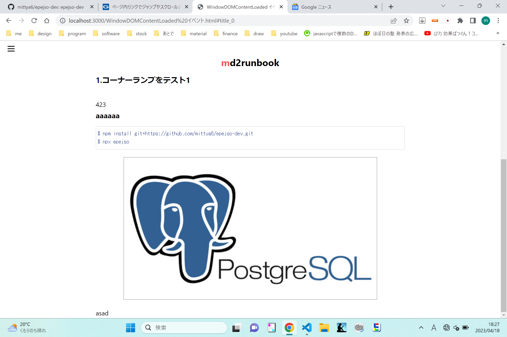

以下はCassidy Williams ( dev.to / Twitter / GitHub / Webサイト ) による投稿、The Productivity apps I use in 2023の日本語訳です。
技術者には珍しくWebサイトがファンシー。

# The Productivity apps I use in 2023
お気に入りのツールや、それをどう使って仕事を進めるのかについてよく聞かれます。
その質問に答えるため、そして次に同じことを聞かれたときにリンクを投げつけるために、この記事を書いています。
効率的ですね！

昨年にも同じ記事を書きましたが、全てを書ききれていなかったのと、さらに書き足したいことがあったことに気が付きました。

なお、この記事では、私が使っているコードエディタ、ターミナルなどの開発者ツールについては対象外です。
ここで取り上げるのは、タスクをこなすために使っているツールです。
また、これらのツールは全てOSを問わずに動作します。
私はWindowsとMacの両方を使用しているので、この要件は私にとってとても重要なことなのです。
OS限定ならもっと適切なアプリも存在するかもしれませんが、それは私の対象外です。

# Obsidian
Obsidianでノートを取り、Obsidianでニュースレターを書き、Obsidianでブログを書き、Obsidianでプロジェクトをトラッキングし、Obsidianで作業計画を立てる……
私はObsidianにすべてを支配されています。

Obsidianはローカルファーストのマークダウンエディタです。
全てをローカルマシンに保つので読み込みに時間がかかったりすることもなく、何人にも邪魔されずマークダウンを書き続けられるところが非常に気に入っています。
また、オープンなプラグインやテーマがあり、さらに有償ですがデバイス間同期機能も存在します。
取り急ぎスマホで簡単なメモを書き留め、その後パソコンで詳細な記事に仕上げるということを私はよくやるのですが、それを行うのにObsidianはパーフェクトなのです。

```sh
$ npm install git+https://github.com/mittya6/epejso-dev.git
$ npx epejso 
```


## Centered
Centeredを使うことでどうなるかというと、要するに、こなせる仕事が倍になります。
初めて使ったときはむしろ余計に時間がかかり、再チャレンジする羽目になりましたが、でも今となってはこれ無しで仕事をやり遂げられる気がしません。
やらなければならないことがたくさんあると全然集中できなくなる、よくあることだと思いますが、Centeredはそんなときに大いに役立ちます。

Centeredは精神をフロー体験に導くTODOアプリです。
非常にシンプルでありながら、非常に多機能であるため、簡単に説明するのは難しいです。
まずはその日のタスクやセッション、あるいはその他なんでもすべてのTODOリストを入力し、各タスクに所要時間を割り振ったら、スタートボタンを押します。
すると集中を増す曲が流れ始め、コーチが現れ、タスクの残り時間を教えてくれたり、休憩をとらせたり、気が散っていたら突っ込んできたりします。
またオプションで作業の様子をカメラ撮影することができるのですが、これが不思議と集中力をさらに高めてくれます。

グループを作ったので、よかったら一緒にフローしませんか？
あるいは他にも学生、Webデベロッパー、趣味といった様々なグループがあり、また友達とプライベートなグループを作ることもできます。

1.aaa


2. asad




1. aaa
2. bbbb
3. cccc

# パターンの確認

あいうえお