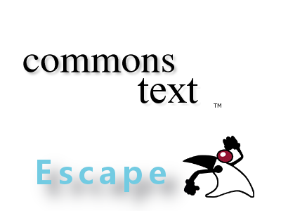

#JSON、HTML・XMLのエスケープはCommonsでやろう。StringEscapeUtils

JSONやHTMLのエスケープを自前メソッドでやりがちだが、エスケープ対象文字が抜けてしまっていたりします。

ひどい場合は、エスケープを理解しておらず全角に変換してしまったりしているアプリもあったりします。

CommonsのStringEscapeUtils使っていると、知らなくても勝手にエスケープしてくれてるので、テスト時に漏れてしまっていても、リリース後に「あの文字もエスケープ対象だったのかぁ」と呑気なことが言えるので素晴らしいライブラリ。

##使い方

使い方は簡単。staticメソッドを呼び出すだけ。

```java
import org.apache.commons.text.StringEscapeUtils;

public class Main {

  public static void main(String[] args) {
    
    String tarStr;
    
    //htmlをエスケープ
    System.out.println("・HTMLをエスケープ");
    tarStr = "<Fran�ais>";
    System.out.println("変換前：" + tarStr);
    System.out.println("変換後：" + StringEscapeUtils.escapeHtml4(tarStr));
    
    System.out.println();
    
    //JSONをエスケープ
    System.out.println("・JSONをエスケープ");
    tarStr = "He didn't say, \"Stop!\"";
    System.out.println("変換前：" + tarStr);
    System.out.println("変換後：" + StringEscapeUtils.escapeJson(tarStr));
    
    System.out.println();
    
    //CSVをエスケープ
    System.out.println("・CSVをエスケープ");
    tarStr = "\",";
    System.out.println("変換前：" + tarStr);
    System.out.println("変換後：" + StringEscapeUtils.escapeCsv(tarStr));
    
    
    System.out.println();
    
    //JavaScriptをエスケープ
    System.out.println("・JavaScriptをエスケープ");
    tarStr = "He didn't say, \"Stop!\"";
    System.out.println("変換前：" + tarStr);
    System.out.println("変換後：" + StringEscapeUtils.escapeEcmaScript(tarStr));
    
    System.out.println();
    
    //XMLをエスケープ
    System.out.println("・XMLをエスケープ");
    tarStr = "\"bread\" & \"butter\"";
    System.out.println("変換前：" + tarStr);
    System.out.println("変換後：" + StringEscapeUtils.escapeXml10(tarStr));
  }
}
```
